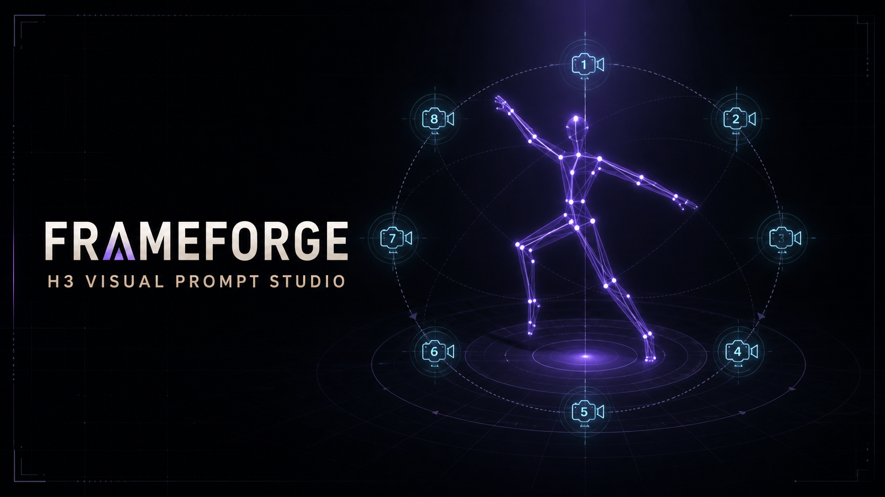

# FRAMEFORGE — MiniMax H3 Visual Prompt Studio

FRAMEFORGE is a visual, browser-based prompt composer for MiniMax H3 video generation. It combines an interactive 3D blocking view, a sortable timeline, detailed manual controls, and structured H3 prompt output.

> **Adults only:** FRAMEFORGE is designed exclusively for fictional depictions of consenting adults aged 18 or older. Users are responsible for following the rules of the model provider and their local laws.



## Feedback wanted

This project is public because practical feedback from H3 users is extremely valuable. Please open an issue for:

- prompt structures that H3 follows—or ignores;
- incorrect 3D poses, camera placement, or body orientation;
- confusing controls on iPhone, iPad, or desktop;
- English or Japanese translation improvements;
- reproducible bugs and feature proposals.

[Report a bug](https://github.com/nasumilk/FRAMEFORGE/issues/new?template=bug_report.yml) · [Suggest an improvement](https://github.com/nasumilk/FRAMEFORGE/issues/new?template=feature_request.yml)

## Features

- T2V, I2V, first/last-frame, and subject-reference prompt modes
- Visual and Manual editing modes
- Interactive 3D pose blocking with orbit, zoom, and camera placement points
- Multi-event timeline with automatic timing
- Detailed subject, partner, action, pose, camera, sound, and continuity controls
- English/Japanese interface switching and Japanese hover translations
- Editable local dropdown master data
- Live structured prompt preview and clipboard export
- Local presets stored in browser storage
- Fully client-side prompt generation with no required external API

FRAMEFORGE creates prompts; it does not itself run MiniMax H3 or upload prompts to a generation service.

## Requirements

- Node.js 22.13 or newer
- npm

## Run locally

```bash
git clone https://github.com/nasumilk/FRAMEFORGE.git
cd FRAMEFORGE
npm install
npm run dev
```

Open the local URL printed by the development server.

## Validation

```bash
npm run lint
npm test
```

`npm test` creates a production build and runs the server-rendering checks.

## Privacy

- Prompt settings and presets are stored locally in the browser.
- The app does not require an API key.
- No prompt-generation API call is made by FRAMEFORGE itself.
- Do not commit personal images, generated media, API keys, or private network addresses.

## Contributing

Issues and pull requests are welcome. Read [CONTRIBUTING.md](CONTRIBUTING.md) before contributing.

Licensed under the [Apache License 2.0](LICENSE), as selected for the public GitHub repository.

---

## 日本語

FRAMEFORGEは、MiniMax H3向けの動画プロンプトを視覚的に組み立てるブラウザアプリです。3D構図表示、タイムライン、詳細なManual設定を組み合わせ、H3用の構造化プロンプトを生成します。

> **成人専用:** 本アプリは、18歳以上の合意ある成人を描写する用途だけを想定しています。利用するモデルの規約と地域の法令を守って使用してください。

### フィードバックを募集しています

次のような情報をGitHub Issuesで共有してもらえると助かります。

- H3で効いた、または効かなかったプロンプト表現
- 3Dポーズ、カメラ位置、身体の向きの誤り
- iPhone、iPad、PCで操作しづらい箇所
- 英語・日本語翻訳の改善案
- 再現手順のある不具合や機能提案

### ローカル起動

```bash
git clone https://github.com/nasumilk/FRAMEFORGE.git
cd FRAMEFORGE
npm install
npm run dev
```

開発サーバーが表示したローカルURLをブラウザで開いてください。プロンプト生成はクライアント内で完結し、APIキーは不要です。
